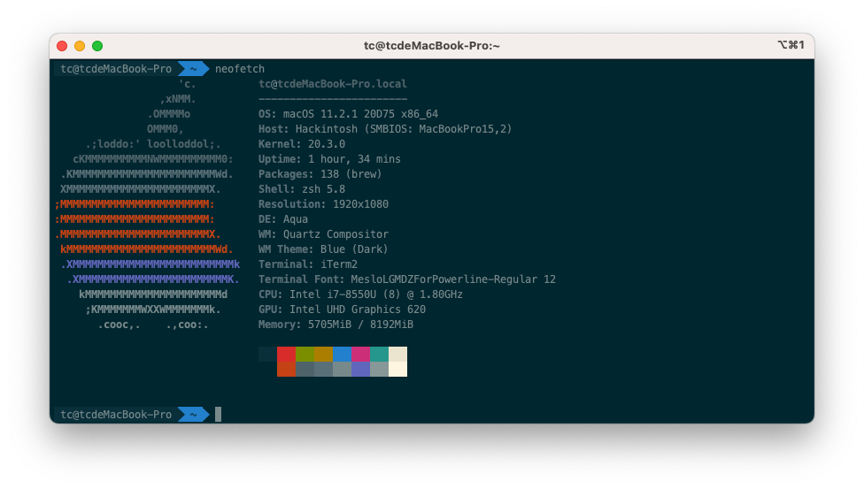

# 联想潮7000-14 Hackintosh

## 电脑配置
|规格 | [详细信息](https://detail.zol.com.cn/1184/1183053/param.shtml) |
|:-: | :-:|
|电脑型号|联想潮7000-14 笔记本电脑|
|操作系统|macOS Big Sur|
|处理器|英特尔 酷睿 i7-85500U|
|内存|8GB单通道|
|硬盘|SAMSUNG MZVLW128HEGR-000L2 128G + ST1000LM035-1RK172 1T|
|显卡|Intel UHD Graphics 620 (UHD620)|
|显示器|14 英寸 IPS 1920 x 1080|
|声卡|Realtek ALC236|
|网卡|BCM94352Z (DW1560)|

##### 机子大概长这样

## 镜像下载
  
  - [[**黑果小兵的部落阁**] :【黑果小兵】原版镜像](https://blog.daliansky.net/categories/下载/镜像/)

## 正常工作
- 显卡 核显UHD620

- 电源

- 蓝牙

- 显示器亮度调节

- 无线 更换了博通网卡BCM94352Z (DW1560)

- 触摸板

- USB

- 声卡 alcid=11

## 不正常工作
- ~~睡眠~~ (有时候会睡死)
- 声卡MIC
